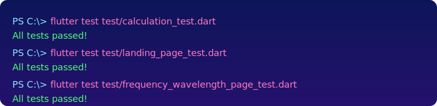

# Physics App

## Overview
A lightweight Flutter companion app that helps students explore core physics concepts through quick calculations and visual summaries.

## Features
- Interactive calculators for kinematics, waves, and other foundational topics.
- Clean landing page that highlights recent concepts and resources.
- Cross-platform Flutter build that runs on mobile, web, and desktop with a shared codebase.

## Run it yourself
1. Ensure Flutter is installed and run `flutter pub get`.
2. Launch the experience with `flutter run` for your target platform.
3. Verify everything with `flutter test` to execute the provided unit suite.
